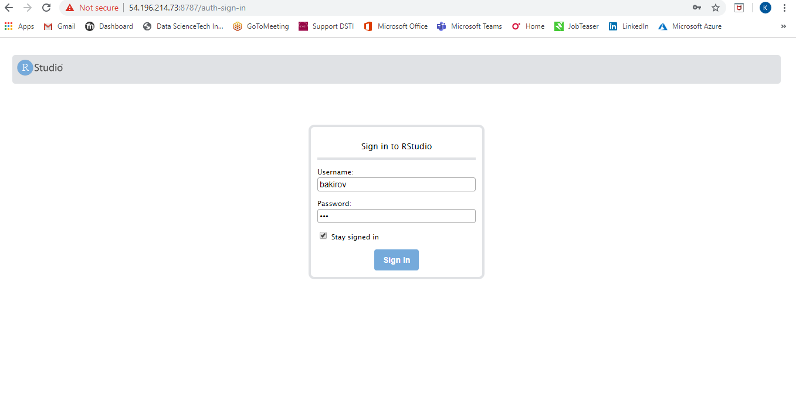
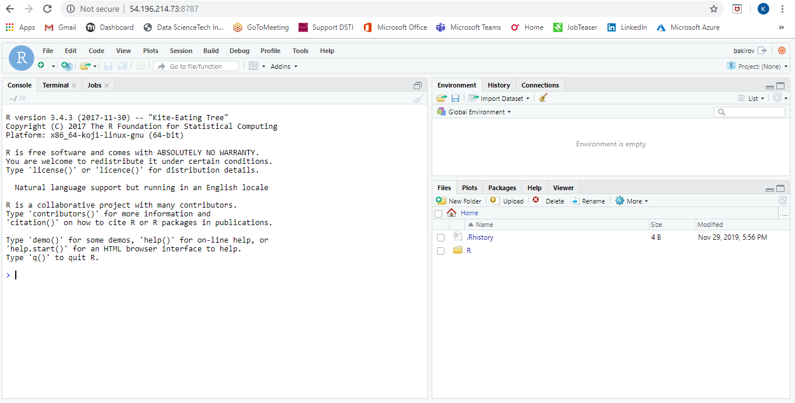

# RStudio server on AWS
 Launch RStudio Server on AWS instance

## **1 step**
 - I have created VPC named "RStudio" with IPv4 "10.0.0.0/16"
 - After attached IGW

## **2 step**
  - Then within VPC created Subnet named "RStudio_Subnet" with IPv4 "10.0.1.0/24"
  - In Route table added destination **0.0.0.0/0** to target IGW

## **3 step**
 - Launched an EC2 instance called "RStudio instance" with automatically assigned public IPv4 **54.196.214.73**
 - In security group configured "Allow TCP" with default port for RStudio **8787** from every IP **0.0.0.0/0**

## **4 step**
- Connect to instance "RStudio instance":
  * ssh -i key.pem ec2-user@<Public-IP>

- Install R using command below:
 - sudo amazon-linux-extras install R3.4

- Install R-studio server:
 - wget https://download2.rstudio.org/server/centos6/x86_64/rstudio-server-rhel-1.2.5019-x86_64.rpm
 - sudo yum install rstudio-server-rhel-1.2.5019-x86_64.rpm

- Start R-Studio server:
 - sudo rstudio-server start

- Add user and password:
 - sudo useradd **username**
 - echo **username:password** | sudo chpasswd

- Connect to RStudio server installed on a AWS instance
 - <Public-IP>:8787

## **Voila!**

